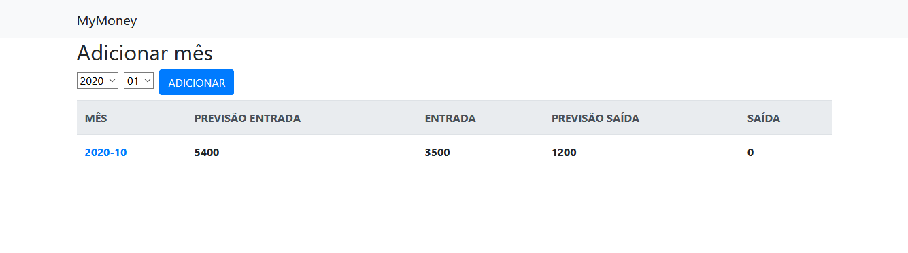
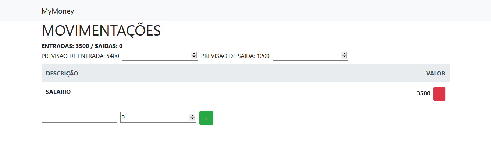
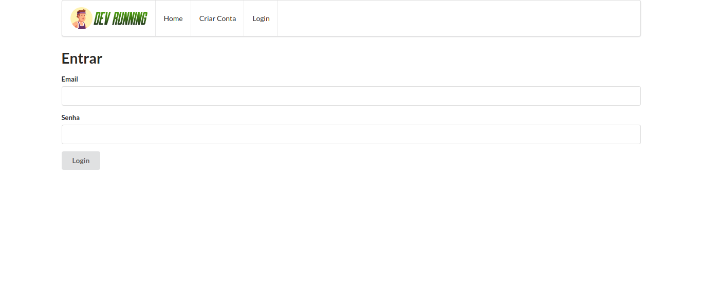
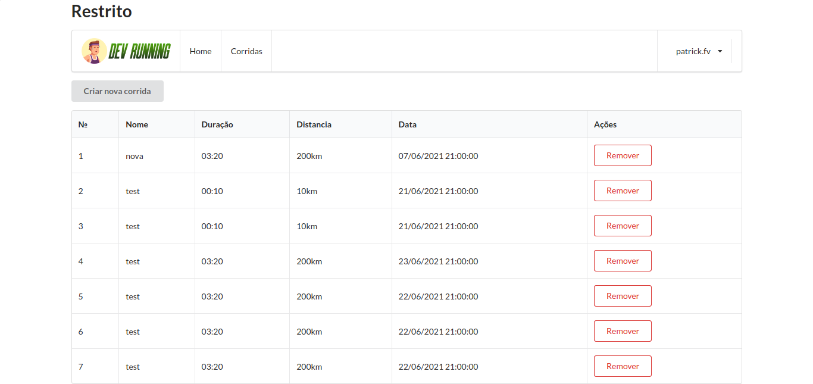
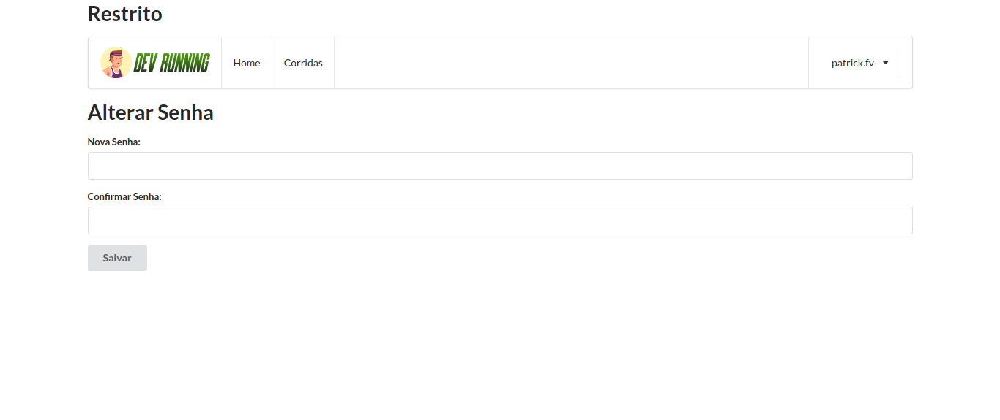
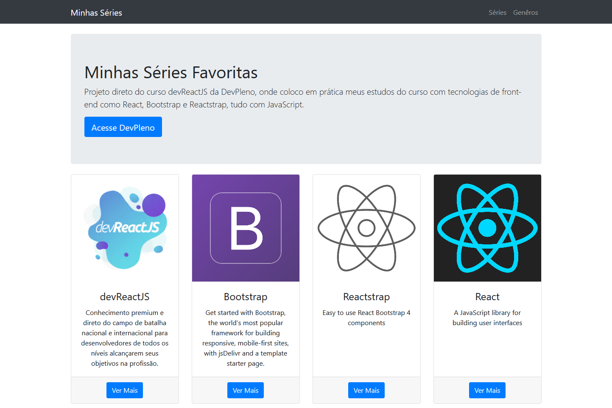
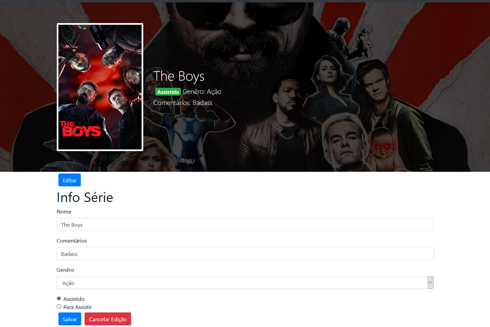

# devpleno-training

codigos do treinamento devpleno ReactJS 

# `MyMoney - DevPleno`

## `Imagens`

## `Realtime Database`

## `Detalhes`

 Aprender conceitos de assincronismo em Javascript, novos conceitos como React Fragments e o hook useRef. Como criar uma Firebase Cloud Function e como publicar o projeto

- JS Basics: assíncronismo com Javascript, Callbacks, Promises e Async/Await
- Publicando o projeto no Firebase Hosting
- Firebase Cloud Function que reage a uma mudança no realtime database
- Hooks personalizados: usePost useDelete useGet
- Adicionando Bootstrap, navegação com React-Router-Dom
- Movimentações
- Adicionar e remover movimentação
- Validação de valor
- Hook useRef e criando um novo mês
- Mostrando meses
- Atualizando previsões / criando hook personalizado usePatch
- Usando Fragments e o useRef em React

# Devrunning

## install and run server

` git clone https://github.com/tuliofaria/devreactjs-bootcamp-runs-server.git `

`cd devreactjs-bootcamp-runs-server && npm start`

## Login

## Corridas

## Alterar Senha

# `Minhas Séries`

Projeto do curso devReactJS, onde coloco em prática meus estudos do curso com tecnologias de front-end como React(conceitos iniciais props, hooks, components), Bootstrap e Reactstrap, tudo com JavaScript.

# `Instalar`

`git clone https://github.com/patrick-fv/minhas-series.git`

`yarn install`

`yarn start-react && yarn start-server`
